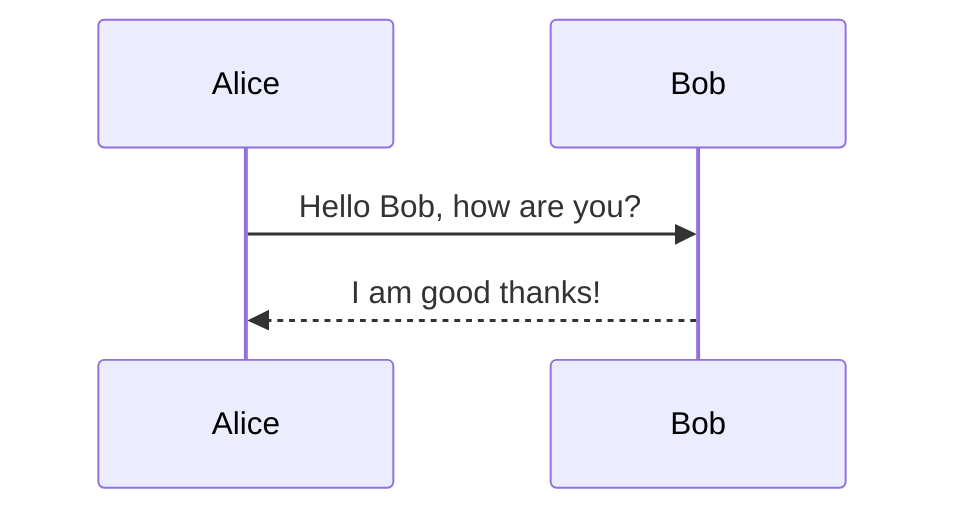
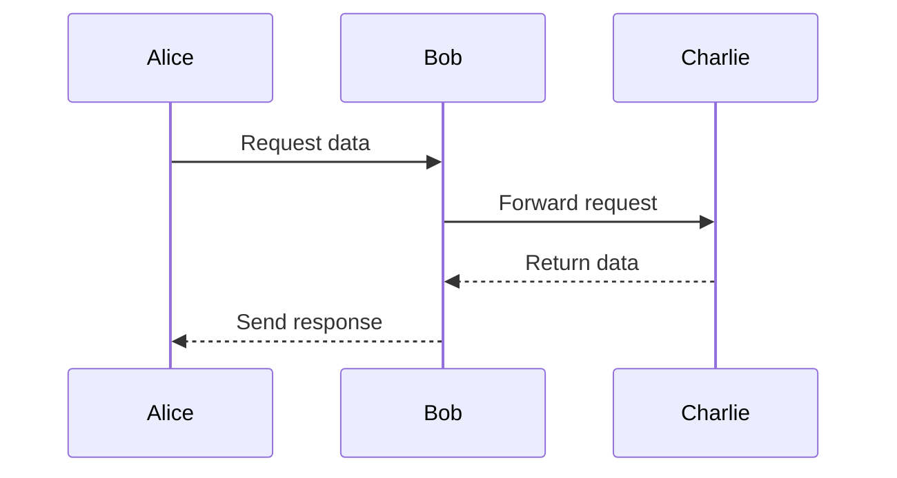
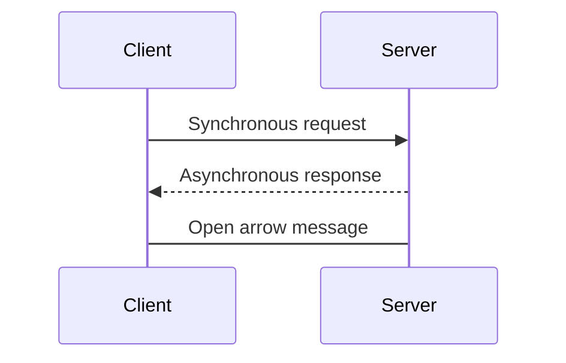
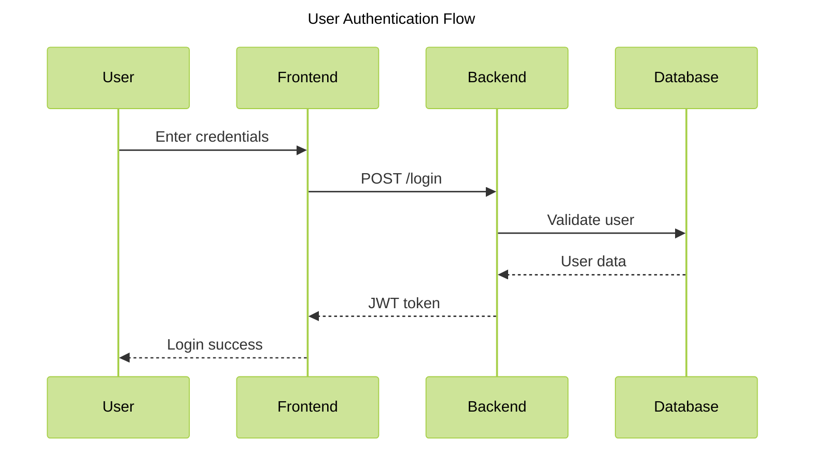
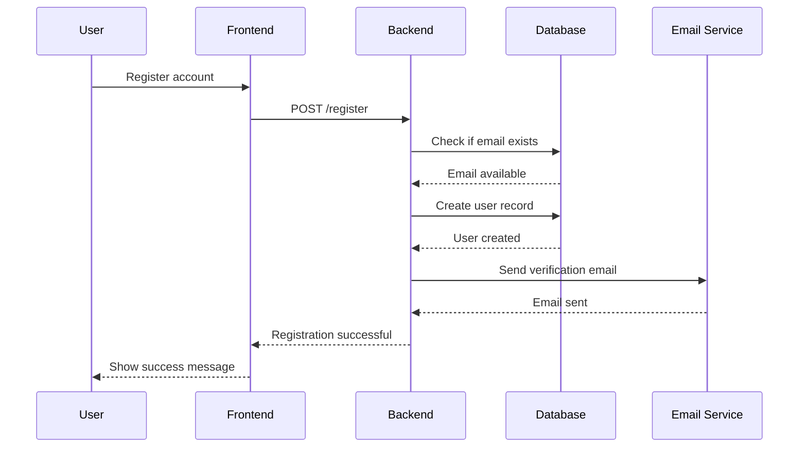
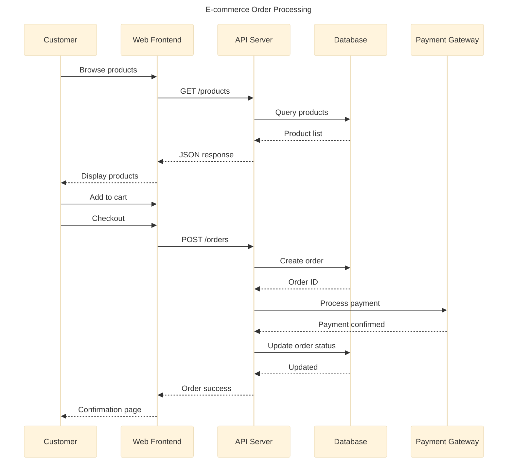

# Mermaid 时序图 (Sequence Diagram) 转换指南

## 📖 概述

本工具支持将 Mermaid 时序图语法转换为 Microsoft Visio 格式。时序图是一种用于描述对象之间交互顺序的图表，常用于系统设计、API 文档和业务流程说明。

## ✅ 支持的功能

### 基本功能
- ✅ **参与者 (Participants)**: 定义序列图中的参与对象
- ✅ **别名 (Aliases)**: 为参与者设置显示名称
- ✅ **消息类型**:
  - 实线箭头 (`->>`) - 同步消息
  - 虚线箭头 (`-->>`) - 异步/返回消息
  - 开放箭头 (`->`) - 未确认的消息
- ✅ **消息文本**: 为箭头添加描述文字
- ✅ **主题配置**: 支持 frontmatter 和 directive 配置

### 当前限制
以下高级功能暂不支持，将在未来版本中实现：
- ⏳ 激活框 (Activation boxes)
- ⏳ 注释 (Notes)
- ⏳ 循环 (Loops)
- ⏳ 条件分支 (Alt/Opt)
- ⏳ 并行执行 (Par)
- ⏳ 序号显示 (autonumber)

## 📝 语法示例

### 1. 基本时序图

最简单的时序图包含两个参与者和一条消息：



**效果说明**：
- Alice 向 Bob 发送同步消息 "Hello Bob, how are you?"
- Bob 向 Alice 返回异步消息 "I am good thanks!"

### 2. 定义参与者

使用 `participant` 关键字显式定义参与者可以控制它们的显示顺序：



**语法说明**：
- `participant A as Alice` - 定义参与者 A，显示名称为 "Alice"
- 如果不使用 `as` 关键字，参与者名称和显示名称相同

### 3. 多种消息类型

展示不同箭头样式的使用：



**箭头类型**：
- `->>` 或 `->>`：实线箭头（同步调用）
- `-->>` 或 `-->`：虚线箭头（异步返回）
- `->`：开放箭头（未确认消息）

### 4. 带主题配置的时序图

使用 frontmatter 配置主题：



### 5. 复杂业务流程示例



## 🎨 配置选项

时序图支持通过 YAML 配置文件自定义样式。配置文件位于 `md2visio/default/sequence.yaml`：

```yaml
config:
    sequence:
        # 布局设置
        actorMargin: 50          # 参与者之间的间距
        width: 150               # 参与者框宽度
        height: 65               # 参与者框高度
        messageMargin: 35        # 消息之间的垂直间距

        # 字体设置
        actorFontSize: 14        # 参与者名称字体大小
        messageFontSize: 16      # 消息文本字体大小

        # 其他选项
        mirrorActors: true       # 是否在底部镜像显示参与者
        showSequenceNumbers: false  # 是否显示序号
```

## 💡 使用建议

### 1. 参与者命名
- 使用简短的标识符（如 A, B, C）作为参与者 ID
- 使用 `as` 关键字为其设置描述性的显示名称
- 避免在显示名称中使用特殊字符

### 2. 消息文本
- 保持消息文本简洁明了
- 对于复杂的描述，考虑使用注释（未来版本支持）
- 使用冒号 `:` 分隔箭头和消息文本

### 3. 布局优化
- 按照交互频率从左到右排列参与者
- 将主要的参与者放在中间位置
- 相关的参与者应该相邻放置

## 🔍 故障排查

### 问题：生成的 Visio 文件无法打开
**解决方案**：
1. 确保已安装 Microsoft Visio 桌面版
2. 检查输出路径是否有写入权限
3. 尝试使用 `/D` 参数查看详细调试信息

### 问题：参与者顺序不正确
**解决方案**：
- 使用 `participant` 关键字显式定义参与者及其顺序
- 在所有消息之前定义所有参与者

### 问题：消息箭头样式不正确
**解决方案**：
- 检查箭头语法是否正确（`->>`, `-->>`, `->` 等）
- 确保消息文本前有冒号 `:`

## 📚 完整示例

以下是一个包含所有当前支持功能的完整示例：



## 🚀 命令行使用

### 基本转换
```bash
md2visio.exe /I sequence.md /O output.vsdx /Y
```

### 显示 Visio 窗口
```bash
md2visio.exe /I sequence.md /O output.vsdx /Y /V
```

### 启用调试模式
```bash
md2visio.exe /I sequence.md /O output.vsdx /Y /D
```

## 📖 参考资源

- [Mermaid 官方时序图文档](https://mermaid.js.org/syntax/sequenceDiagram.html)
- [UML 时序图规范](https://www.omg.org/spec/UML/)
- [项目 GitHub 仓库](https://github.com/konbakuyomu/md2visio-gui)

## 🤝 反馈与贡献

如果您在使用时序图功能时遇到问题或有改进建议，欢迎：
- 在 [GitHub Issues](https://github.com/konbakuyomu/md2visio-gui/issues) 提交问题
- 提交 Pull Request 贡献代码
- 分享您的使用案例和技巧

---

**版本信息**: 本文档更新于 2025-12-25，适用于 md2visio-gui v1.x
