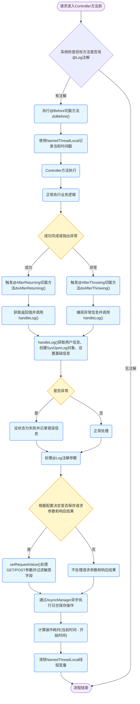

```mermaid
flowchart TD
    classDef startend fill:#F5EBFF,stroke:#BE8FED,stroke-width:2px
    classDef process fill:#E5F6FF,stroke:#73A6FF,stroke-width:2px
    classDef decision fill:#FFF6CC,stroke:#FFBC52,stroke-width:2px

    A(["请求进入Controller方法前"]):::startend --> B{"系统检查目标方法是否有@Log注解"}
    B -->|有注解| C("执行@Before切面方法doBefore()"):::process
    C --> D("使用NamedThreadLocal记录当前时间戳"):::process
    D --> E("Controller方法执行"):::process
    E --> F("正常执行业务逻辑"):::process
    F --> G{"成功完成或抛出异常"}:::decision
    G -->|成功| H("触发@AfterReturning切面方法doAfterReturning()"):::process
    H --> I("获取返回值并调用handleLog()"):::process
    G -->|异常| J("触发@AfterThrowing切面方法doAfterThrowing()"):::process
    J --> K("捕获异常信息并调用handleLog()"):::process
    I --> L("handleLog()获取用户信息、创建SysOperLog对象、设置基础信息"):::process
    K --> L
    L --> M{"是否异常"}:::decision
    M -->|是| N("设状态为失败并记录错误信息"):::process
    M -->|否| O("正常处理"):::process
    N --> P("处理@Log注解参数"):::process
    O --> P
    P --> Q{"根据配置决定是否保存请求参数和响应结果"}:::decision
    Q -->|是| R("setRequestValue()处理GET/POST参数并过滤敏感字段"):::process
    Q -->|否| S("不处理请求参数和响应结果"):::process
    R --> T("通过AsyncManager异步执行日志保存操作"):::process
    S --> T
    T --> U("计算操作耗时(当前时间 - 开始时间)"):::process
    U --> V("清除NamedThreadLocal线程变量"):::process
    V --> W(["流程结束"]):::startend
    B -->|无注解| W
```